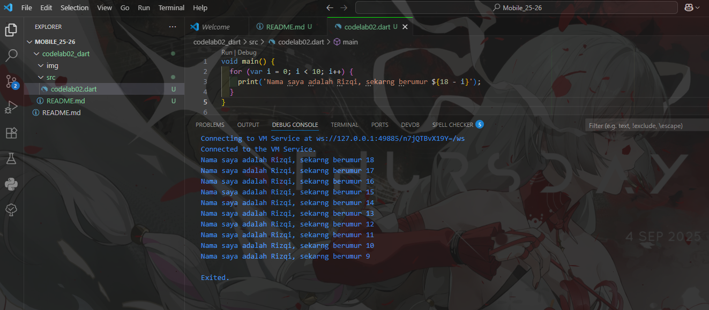

Soal 1
Modifikasilah kode pada baris 3 di VS Code atau Editor Code favorit Anda berikut ini agar mendapatkan keluaran (output) sesuai yang diminta!

Output yang diminta (Gantilah Fulan dengan nama Anda):

<h2 align="center">Jawaban  

</h2>

Soal 2
Mengapa sangat penting untuk memahami bahasa pemrograman Dart sebelum kita menggunakan framework Flutter ? Jelaskan!

- Karena Flutter menggunakan bahasa dart, flutter hanyalah workplace yang berisikan tools yang memudahkan kita mengoding menggunakan dart. Jadi minimal kita harus mengetahui dasar dari bahasa dart itu sendiri.

Soal 3
Rangkumlah materi dari codelab ini menjadi poin-poin penting yang dapat Anda gunakan untuk membantu proses pengembangan aplikasi mobile menggunakan framework Flutter.

- dart adalah bahasa pemrogramman buatan google dari gabungan java dan js
- sekali coding di flutter, code dapat berjalan di 3 tempat, yaitu desktop, mobile, dan website.
- karena gabungan java maka ada oop
- variable bisa menjadi function

Soal 4
Buatlah penjelasan dan contoh eksekusi kode tentang perbedaan Null Safety dan Late variabel !

- null safety adalah rules agar tidak ada variable yang berisikan null, tetapi jika kita memang ingin variable itu berisikan null, maka gunakan "?" di sebelah variable. Contoh String? name = null atau juga bisa String? name;
