## Praktikum 1: Menerapkan Control Flows ("if/else")
Langkah 1:
Ketik atau salin kode program berikut ke dalam fungsi `main()`.

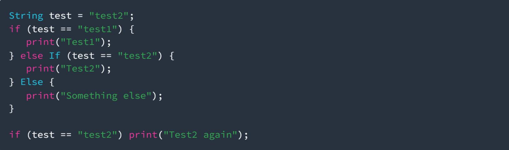

Langkah 2:
Silakan coba eksekusi (Run) kode pada langkah 1 tersebut. Apa yang terjadi? Jelaskan!

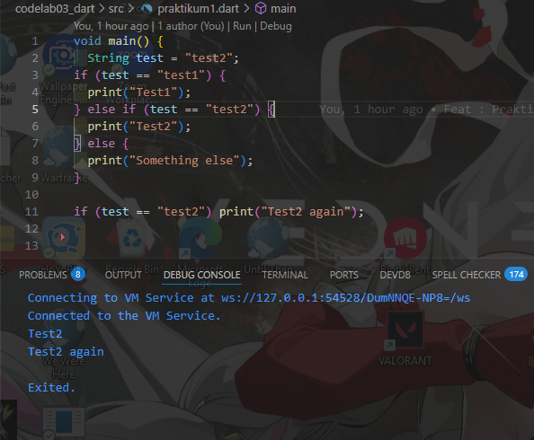
 karena test bernilai test2 maka argument di dalam elseif test == test2 dijalankan, dan pada kode tenery karena syarat memenuhi yaitu test == test2 maka test2 again diprint jika tidak terpenuhi tidak print apa - apa

Langkah 3:
Tambahkan kode program berikut, lalu coba eksekusi (Run) kode Anda.

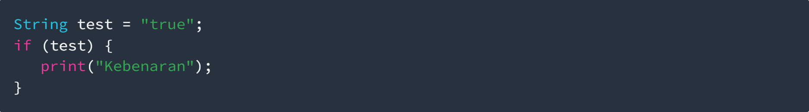
  dengan melakukan perbaikan kode, berikut adalah hasilnya

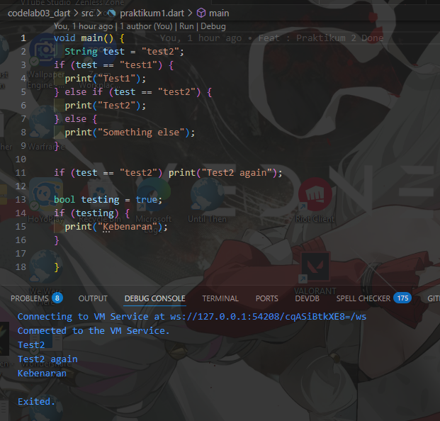

## Praktikum 2: Menerapkan Perulangan "while" dan "do-while"
Langkah 1:
Ketik atau salin kode program berikut ke dalam fungsi `main()`.

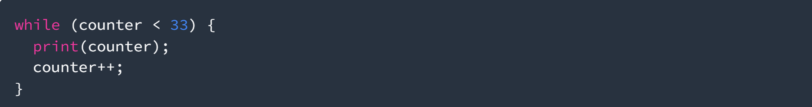

Langkah 2:
Silakan coba eksekusi (Run) kode pada langkah 1 tersebut. Apa yang terjadi? Jelaskan! Lalu perbaiki jika terjadi error.

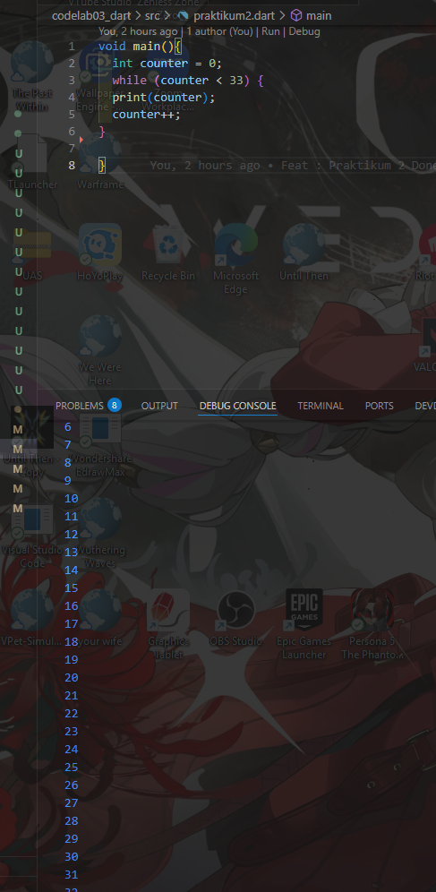

Langkah 3:
Tambahkan kode program berikut, lalu coba eksekusi (Run) kode Anda.

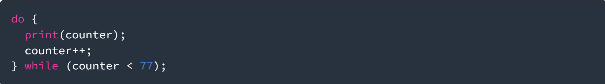
  maka hasilnya akan terlihat seperti ini

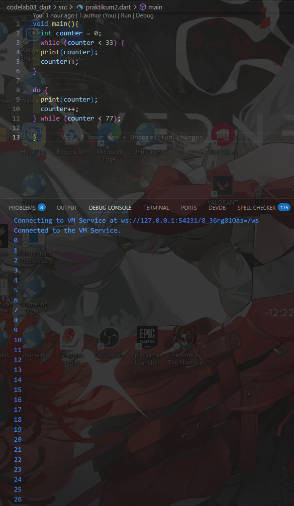

## Praktikum 3: Menerapkan Perulangan "for" dan "break-continue"
Langkah 1:
Ketik atau salin kode program berikut ke dalam fungsi `main()`.

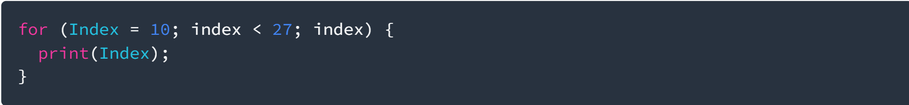

Langkah 2:
Silakan coba eksekusi (Run) kode pada langkah 1 tersebut. Apa yang terjadi? Jelaskan! Lalu perbaiki jika terjadi error.

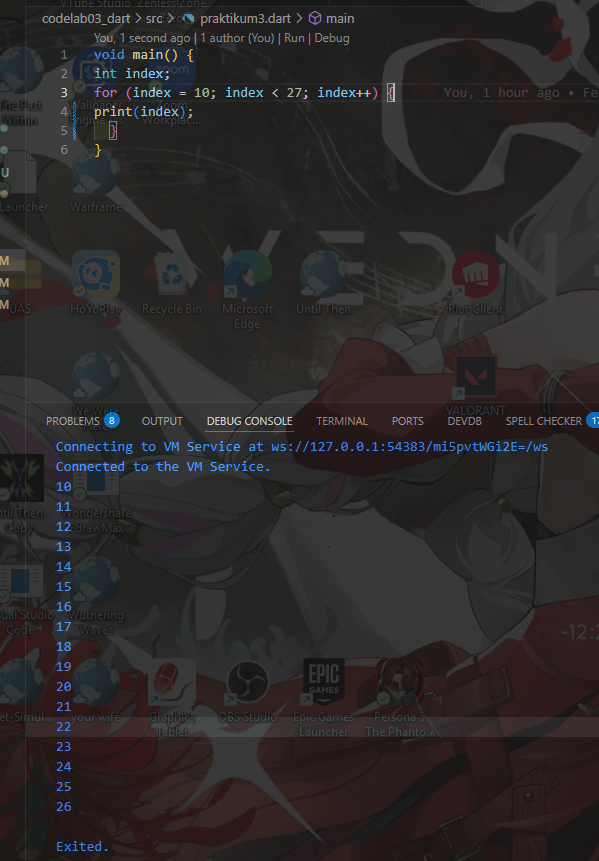
 loop berjalan dari 10 dan berhenti ketika nilai index 27

Langkah 3:
Tambahkan kode program berikut di dalam for-loop, lalu coba eksekusi (Run) kode Anda.

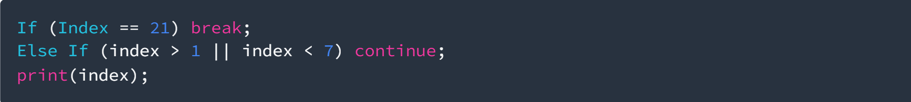
 mungkin seperti ini yang diinginkan ?

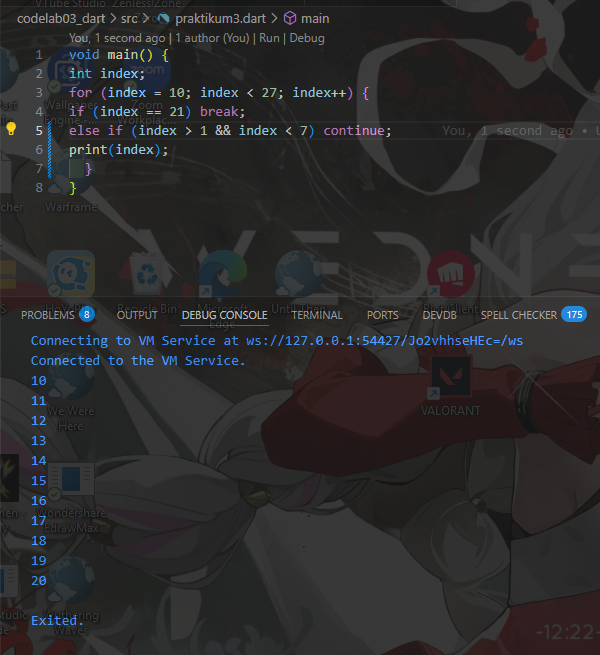

## Tugas Praktikum
Buatlah sebuah program yang dapat menampilkan bilangan prima dari angka 0 sampai 201 menggunakan Dart. Ketika bilangan prima ditemukan, maka tampilkan nama lengkap dan NIM Anda.

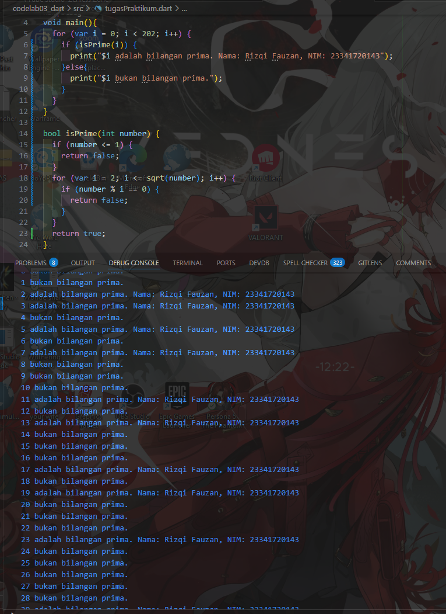

