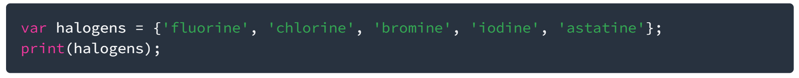

    Nama    : Rizqi Fauzan
    NIM     : 2341720143
    Kelas   : TI-3H
    Presensi: 26

# Jobsheet 4
## Praktikum 1: 
Eksperimen Tipe Data List
Selesaikan langkah-langkah praktikum berikut ini menggunakan VS Code atau Code Editor favorit Anda.

### Langkah 1:
Ketik atau salin kode program berikut ke dalam `void main()`

### Langkah 2:
Silakan coba eksekusi (Run) kode pada langkah 1 tersebut. Apa yang terjadi? Jelaskan!
- print(list.length) adalah menampilkan panjang list yaitu 3
- print(list[1]) menampilkan isi list di index 1 yaitu 2
- print(list[1]) menampilkan isi list pada index 1 tetap isinya telah diubah oleh list[1]=1; maka hasil yang muncul adalah 1

### Langkah 3:
Ubah kode pada langkah 1 menjadi variabel final yang mempunyai index = 5 dengan default value = `null`. Isilah nama dan NIM Anda pada elemen index ke-1 dan ke-2. Lalu print dan capture hasilnya.

Apa yang terjadi ? Jika terjadi error, silakan perbaiki.

## Praktikum 2:
Eksperimen Tipe Data Set
Selesaikan langkah-langkah praktikum berikut ini menggunakan VS Code atau Code Editor favorit Anda.

### Langkah 1:
Ketik atau salin kode program berikut ke dalam fungsi `main()`.

### Langkah 2:
Silakan coba eksekusi (Run) kode pada langkah 1 tersebut. Apa yang terjadi? Jelaskan! Lalu perbaiki jika terjadi error.
- isi list akan diprint semua tanpa harus menggunakan syntax selain print tetapi masih ada {}

### Langkah 3:
Tambahkan kode program berikut, lalu coba eksekusi (Run) kode Anda.

Apa yang terjadi ? Jika terjadi error, silakan perbaiki namun tetap menggunakan ketiga variabel tersebut. Tambahkan elemen nama dan NIM Anda pada kedua variabel Set tersebut dengan dua fungsi berbeda yaitu `.add()` dan `.addAll()`. Untuk variabel Map dihapus, nanti kita coba di praktikum selanjutnya.
- sebelum ditambahkan terdapat 3 {} yang kosong

Dokumentasikan code dan hasil di console, lalu buat laporannya.

## Praktikum 3 : 
Eksperimen Tipe Data Maps
Selesaikan langkah-langkah praktikum berikut ini menggunakan VS Code atau Code Editor favorit Anda.

### Langkah 1:
Ketik atau salin kode program berikut ke dalam fungsi `main()`.

### Langkah 2:
Silakan coba eksekusi (Run) kode pada langkah 1 tersebut. Apa yang terjadi? Jelaskan! Lalu perbaiki jika terjadi error.

- mengeprint map key dan isi nya

### Langkah 3:
Tambahkan kode program berikut, lalu coba eksekusi (Run) kode Anda.

Apa yang terjadi ? Jika terjadi error, silakan perbaiki.

- cara mengambil/mengupdate map adalah menggunakan key bukan index

Tambahkan elemen nama dan NIM Anda pada tiap variabel di atas (`gifts`, `nobleGases`, `mhs1`, dan `mhs2`). Dokumentasikan hasilnya dan buat laporannya!

## Praktikum 4 : 
Eksperimen Tipe Data List: Spread dan Control-flow Operators
Selesaikan langkah-langkah praktikum berikut ini menggunakan VS Code atau Code Editor favorit Anda.

### Langkah 1:
Ketik atau salin kode program berikut ke dalam fungsi main().

### Langkah 2:
Silakan coba eksekusi (Run) kode pada langkah 1 tersebut. Apa yang terjadi? Jelaskan! Lalu perbaiki jika terjadi error.

- print(list1); menampilkan semua isi list1
- print(list2); menampilkan semua isi list2 yang isinya ada list1
- print(list2.length); menampilkan panjang list2 yang isinya ada list1

### Langkah 3:
Tambahkan kode program berikut, lalu coba eksekusi (Run) kode Anda.

Apa yang terjadi ? Jika terjadi error, silakan perbaiki.

- list bisa berisikan null dan list bisa berisikan list yang isinya terdapat null

Tambahkan variabel list berisi NIM Anda menggunakan Spread Operators. Dokumentasikan hasilnya dan buat laporannya!

### Langkah 4:
Tambahkan kode program berikut, lalu coba eksekusi (Run) kode Anda.

Apa yang terjadi ? Jika terjadi error, silakan perbaiki. Tunjukkan hasilnya jika variabel promoActive ketika `true` dan `false`.
- kita dapat memasukkan if kedalam list
### Langkah 5:
Tambahkan kode program berikut, lalu coba eksekusi (Run) kode Anda.

Apa yang terjadi ? Jika terjadi error, silakan perbaiki. Tunjukkan hasilnya jika variabel `login` mempunyai kondisi lain.
- kita juga dapat memasukkan case ke dalam list

### Langkah 6:
Tambahkan kode program berikut, lalu coba eksekusi (Run) kode Anda.

Apa yang terjadi ? Jika terjadi error, silakan perbaiki. Jelaskan manfaat **Collection For** dan dokumentasikan hasilnya.
- kita juga dapat memasukkan loop ke dalam list
### Praktikum 5: Eksperimen Tipe Data Records

Selesaikan langkah-langkah praktikum berikut ini menggunakan VS Code atau Code Editor favorit Anda.

### Langkah 1:
Ketik atau salin kode program berikut ke dalam fungsi main().

### Langkah 2:
Silakan coba eksekusi (Run) kode pada langkah 1 tersebut. Apa yang terjadi? Jelaskan! Lalu perbaiki jika terjadi error.
- record adalah list yang isinya campur campur dan ketika diprint akan di kelompokkan

### Langkah 3:
Tambahkan kode program berikut di luar scope void main(), lalu coba eksekusi (Run) kode Anda.

Apa yang terjadi ? Jika terjadi error, silakan perbaiki. Gunakan fungsi tukar() di dalam main() sehingga tampak jelas proses pertukaran value field di dalam Records.
- kita dapat mengubah urutan fields records dengan kode diatas

### Langkah 4:
Tambahkan kode program berikut di dalam scope void main(), lalu coba eksekusi (Run) kode Anda.

Apa yang terjadi ? Jika terjadi error, silakan perbaiki. Inisialisasi field nama dan NIM Anda pada variabel record mahasiswa di atas. Dokumentasikan hasilnya dan buat laporannya!
- ngeprint records seperti yang pertama tapi dengan rules isinya String dan int
### Langkah 5:
Tambahkan kode program berikut di dalam scope void main(), lalu coba eksekusi (Run) kode Anda.

Apa yang terjadi ? Jika terjadi error, silakan perbaiki. Gantilah salah satu isi record dengan nama dan NIM Anda, lalu dokumentasikan hasilnya dan buat laporannya!

## Tugas Praktikum

1. Silakan selesaikan Praktikum 1 sampai 5, lalu dokumentasikan berupa screenshot hasil pekerjaan Anda beserta penjelasannya!
2. Jelaskan yang dimaksud Functions dalam bahasa Dart!
- block code yang memiliki fungsi dan nama, ketika namanya dipanggil fungsi itu akan berjalan
3. Jelaskan jenis-jenis parameter di Functions beserta contoh sintaksnya!
- Named parameters : parameter bernama, urut

        /// Sets the [bold] and [hidden] flags ...
        void enableFlags({bool? bold, bool? hidden}) {
            ...
        }
- Optional positional parameters : parameter yang urutannya optional ditandai []

        String say(String from, String msg, [String? device]) {
            var result = '$from says $msg';
            if (device != null) {
                result = '$result with a $device';
            }
            return result;
        }
4. Jelaskan maksud Functions sebagai first-class objects beserta contoh sintaknya!
- function bisa kita pass menjadi parameter

        void printElement(int element) {
            print(element);
        }

        var list = [1, 2, 3];

        // Pass printElement as a parameter.
        list.forEach(printElement);

- function juga bisa kita jadikan variable
        
        var loudify = (msg) => '!!! ${msg.toUpperCase()} !!!';
        assert(loudify('hello') == '!!! HELLO !!!');
5. Apa itu Anonymous Functions? Jelaskan dan berikan contohnya!
- function tanpa nama

        const list = ['apples', 'bananas', 'oranges'];

        var uppercaseList = list.map((item) {
            return item.toUpperCase();
        }).toList();
        // Convert to list after mapping

        for (var item in uppercaseList) {
            print('$item: ${item.length}');
        }
6. Jelaskan perbedaan Lexical scope dan Lexical closures! Berikan contohnya!
- Lexical Scope : nested Fuction/fungsi di dalam fungsi

        bool topLevel = true;

        void main() {
            var insideMain = true;

            void myFunction() {
                var insideFunction = true;

                void nestedFunction() {
                    var insideNestedFunction = true;

                    assert(topLevel);
                    assert(insideMain);
                    assert(insideFunction);
                    assert(insideNestedFunction);
                    }
                }
            }
- Lexical Closures : Fungsi dari luar yang dapat di panggil oleh fungsi lain

        /// Returns a function that adds [addBy] to the
        /// function's argument.
        Function makeAdder(int addBy) {
            return (int i) => addBy + i;
        }

        void main() {
            // Create a function that adds 2.
            var add2 = makeAdder(2);

            // Create a function that adds 4.
            var add4 = makeAdder(4);

            assert(add2(3) == 5);
            assert(add4(3) == 7);
        }
7. Jelaskan dengan contoh cara membuat return multiple value di Functions!
    
        (String, int) foo() {
            return ('something', 42);
        }